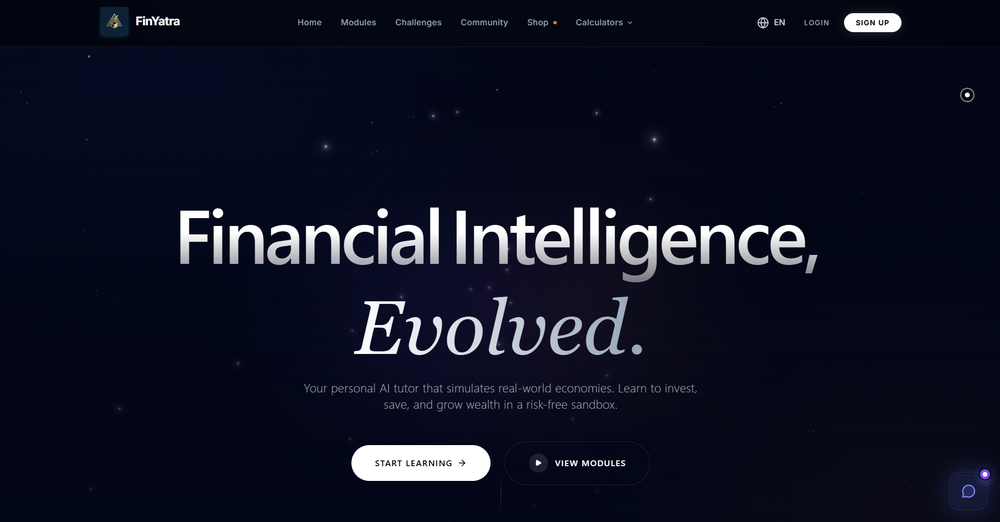
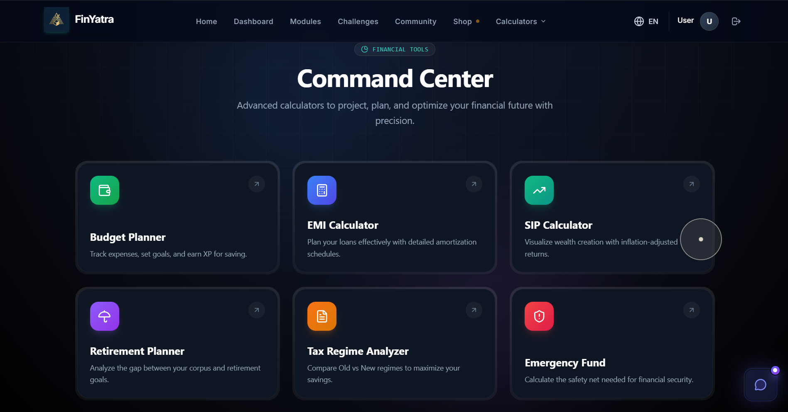
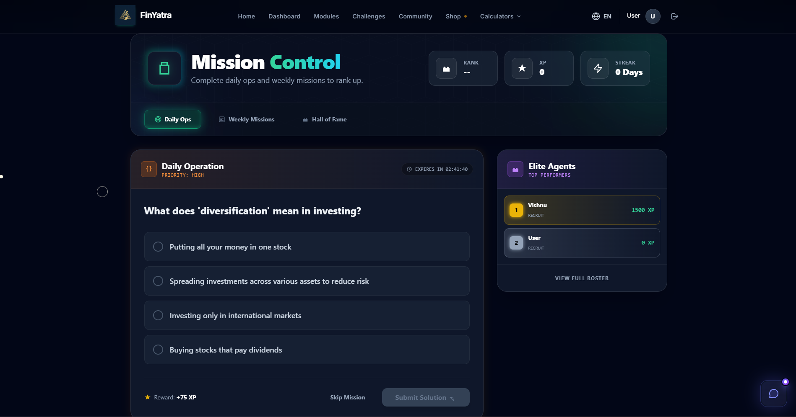
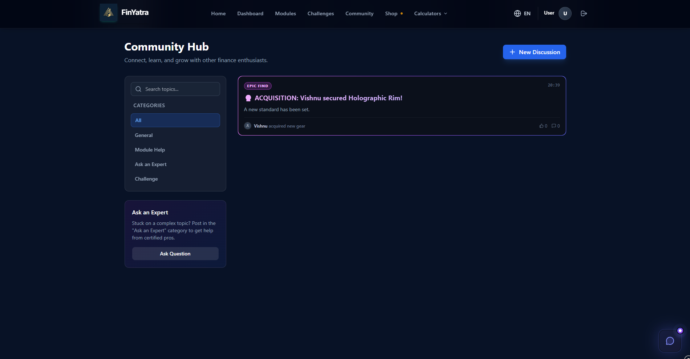

# FinanceYatra 🚀

**FinanceYatra** is a comprehensive financial literacy platform designed to educate users about personal finance through interactive modules, calculators, and quizzes. The goal is to make financial concepts accessible, engaging, and easy to understand for everyone.



## 🌟 Key Features

*   **Interactive Learning Modules**: Step-by-step guides on various financial topics.
*   **Smart Calculators**: specialized calculators for SIP, Taxes, Loans, and more.
*   **Gamified Quizzes**: Daily challenges and quizzes to test your knowledge and earn XP.
*   **Community Forums**: Discuss financial queries with peers.
*   **Bilingual Support**: Available in English and regional languages (e.g., Telugu).
*   **AI Assistant**: (In Development) Integrated RAG-based chatbot for answering financial queries.

## 🛠️ Tech Stack

### Frontend
-   **Core**: React, Vite
-   **Styling**: TailwindCSS, Styled Components
-   **3D/Visuals**: Three.js, React Three Fiber
-   **Routing**: React Router
-   **State/Data**: React Query, Axios

### Backend
-   **Runtime**: Node.js
-   **Framework**: Express
-   **AI/ML**: Python (RAG System) - *Note: Backend services facilitate the chatbot and data management.*

## 🚀 Getting Started

### Prerequisites
-   Node.js (v16+)
-   Python (v3.10+) (For AI services)

### Installation

1.  **Clone the repository**:
    ```bash
    git clone https://github.com/Vishnuvardhanvemula/FinanceYatra.git
    cd FinanceYatra
    ```

2.  **Install Frontend Dependencies**:
    ```bash
    cd frontend
    npm install
    ```

3.  **Install Backend Dependencies**:
    ```bash
    cd ../backend
    npm install
    ```

### Running the Application

**Quick Start Script (Windows)**:
You can start all services (Frontend, Backend, and Python RAG) using the provided PowerShell script:
```powershell
./scripts/start-all.ps1
```

**Manual Start**:

1.  **Frontend**:
    ```bash
    cd frontend
    npm run dev
    ```
    Access at `http://localhost:5173`

2.  **Backend**:
    ```bash
    cd backend
    npm run dev
    ```
    Server runs on `http://localhost:5000`

## 📂 Project Structure

-   `frontend/`: React application source code.
    -   `src/pages/`: Main application pages.
        -   **Note**: `HomePage2.jsx` is the primary landing page component.
    -   `src/components/`: Reusable UI components.
    -   `src/assets/`: Images and static resources.
-   `backend/`: Node.js backend API.
-   `scripts/`: Utility scripts for automation.

## 📸 Screenshots

| Dashboard | Calculators |
|:---:|:---:|
|  |  |

| Quizzes | Community |
|:---:|:---:|
|  |  |

---
*Empowering your financial journey, one step at a time.*
